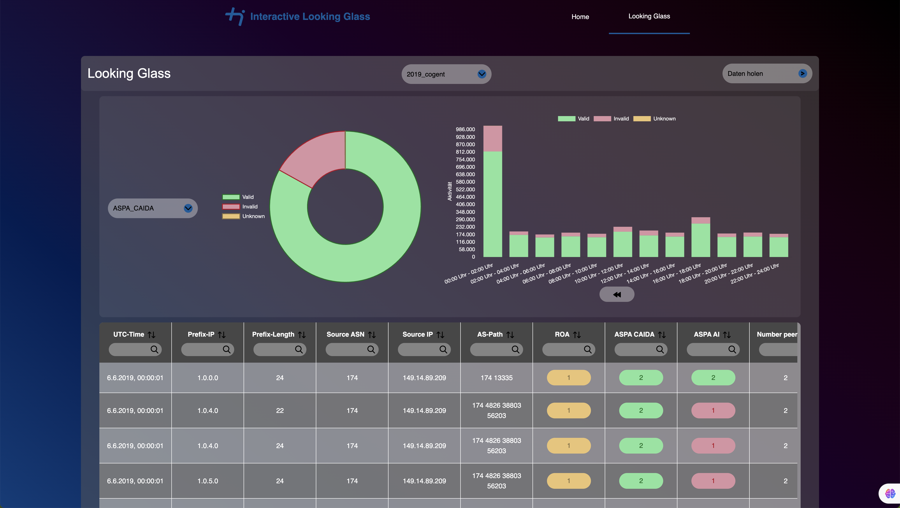

# bgp-routing-looking-glass



#### Frontend:

- The source code for the React frontend can be found under `webapp/frontend/code/src`.
- The production build is located under `webapp/frontend/code/build`. The server application `app.py` in `webapp/backend` relies on this build to provide the frontend functionality.
- The frontend can be manually started in dev mode using npm. To do this, first execute `npm install` in the `webapp/frontend/code` directory, followed by `npm start`. The default port is 8080, which can be changed in the `package.json` under `scripts.start`. When starting the frontend in dev mode, either adjust the endpoints in `src/helper/request-builder.js` or remove/comment out the server requests in this file and adjust the return values.

#### Backend:

- The source code for the backend is located under `webapp/backend`.
- `app.py` is the main server application. To start the server, execute `python3 app.py` in your console. The server application simultaneously launches the frontend from `webapp/frontend/build` and is accessible at `http://127.0.0.1:8080/`
- The script `sort_raw_exabgp_data.py` is designed to read raw ExaBGP datasets from a file and organize them into a folder structure based on timestamps. This approach is necessary to make data processing on the server side more efficient and quickly handle a large number of individual JSON datasets. To create a new data source in `/database` using this script, execute the following command in your console: `python3 sort_raw_exabgp_data <place_your_foldername_here> <place_your_raw_dataset_file_here>`. The raw dataset file must have individual JSON records structured as follows, each in a separate line:

```JSON
	{
		"prefix": "1.0.4.0",
		"length": 22,
		"aspath": ["6939", "4826", "38803", "56203"],
		"roa1": 1,
		"aspa1": 0,
		"aspa2": 2,
		"sourceip": "80.249.208.255",
		"sourceasn": "6777",
		"numberpeers": 4,
		"nexthopip": "80.249.209.150",
		"timestamp": 1559779201
	}`
```

- `/database` is used by `app.py` to deliver data to the frontend.
- In `/helper`, you will find the source code for filtering the records in the table, paginating the table, and making metadata requests.
- Before starting the app.py application, you need to create a database folder using the script sort_raw_exabgp_data.py so that the application has data. For example, you can use the example_datasets.jsons dataset with the following command: python3 sort_raw_exabgp_data.py example example_datasets.jsons.
- When you then start the server application `app.py` and then visit the frontend at `http://127.0.0.1:8080/`, you can select an example data source in the Looking Glass. This source is located under `/database/example`
